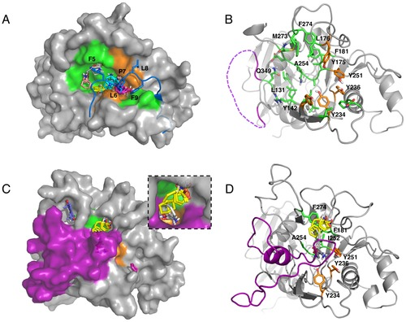
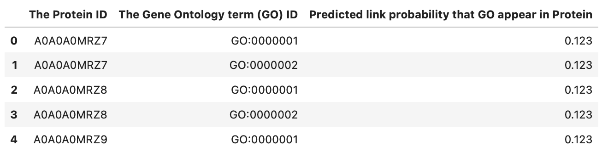
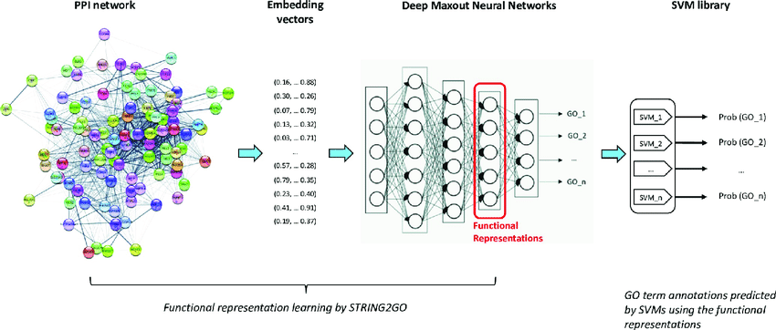

# CAFA 5 Kaggle Competition : Protein Function Prediction

## 1. Problem Framing

This Kaggle competition aims to predict the function of proteins using their amino-acid sequences and additional data. Understanding protein function is crucial for comprehending cellular processes and developing new treatments for diseases. With the abundance of genomic sequence data available, assigning accurate biological functions to proteins becomes challenging due to their multifunctionality and interactions with various partners. This competition, hosted by the Function Community of Special Interest (Function-COSI), brings together computational biologists, experimental biologists, and biocurators to improve protein function prediction through data science and machine learning approaches. The goal is to contribute to advancements in medicine, agriculture, and overall human and animal health.

## 2. What to submit ?

This competition evaluates participants' predictions of Gene Ontology (GO) terms for protein sequences. The evaluation is performed on a test set of proteins that initially have no assigned functions but may accumulate experimental annotations after the submission deadline. The test set is divided into three subontologies: Molecular Function (MF), Biological Process (BP), and Cellular Component (CC). Participants are scored separately for each subontology. The final performance measure is the arithmetic mean of the maximum F-measures calculated on the three subontologies. Weighted precision and recall are used, taking into account the hierarchical structure of the GO. The evaluation code is publicly available. The leaderboard displays performance on a subset of proteins not included in the final test set, so generalization performance is crucial. Submission files should contain protein-target pairs with corresponding GO terms and estimated probabilities, within a specific score range. The predictions are propagated to parent terms if not explicitly listed. There is a limit on the number of terms associated with each protein. If a protein is not listed in the submission file, it is assumed that all predictions for that protein are zero.

## 3. Evaluation Metric

The evaluation metric used in this competition is the weighted F-measure, which combines precision and recall, taking into account the hierarchical structure of the Gene Ontology (GO). The formula for calculating the weighted F-measure is as follows:

$Weighted \ F-measure = \frac{(1 + β^2) * (weighted \ precision * weighted recall)}{((β^2 * weighted \ precision) + weighted \ recall)}$

where:
- β is a parameter that controls the trade-off between precision and recall. In this competition, β is set to 1, resulting in an equal weighting of precision and recall.
- Weighted precision is the precision score, considering the weights of the predicted terms. It is calculated as the sum of the products of the predicted term's weight and its true positive count, divided by the sum of the weights of all predicted terms.
- Weighted recall is the recall score, considering the weights of the true positive terms. It is calculated as the sum of the products of the true positive term's weight and its count, divided by the sum of the weights of all true positive terms.

Note: The specific formulas for weighted precision and weighted recall are provided in the competition materials and utilize additional information such as term weights and true positive counts.

## 4. General Baseline 

