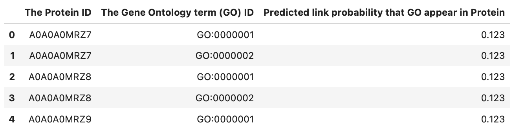

# [CAFA 5 Kaggle Competition : Protein Function Prediction](https://www.kaggle.com/competitions/cafa-5-protein-function-prediction/overview)

We took a look at the competition context and developed a first model for this 5th edition of the CAFA competition named **proteiNet** : https://www.kaggle.com/code/henriupton/proteinet-pytorch-ems2-t5-protbert-embeddings

Following this, we implemented various additions to build its big brother: **ProteiNet v2**! This new version actually aims to train not one, not two, but 3 models, all three specialized in predicting a group of GOs of a particular aspect among the three sets presented for CAFA5: Molecular Function (MF), Biological Process (BP), and Cellular Component (CC).

The first section of proteiNet v2 is dedicated to the training part of the models. If you want to have a look into the inference section, follow this link : https://www.kaggle.com/code/henriupton/proteinet-aspects-experts-infer

The second section of proteiNet v2 is dedicated to the inference part from the models trained in first section. If you want to have a look into the inference section, follow this link : https://www.kaggle.com/code/henriupton/proteinet-v2-inference-notebook

Feel free to give feedback for improvement !

## 1. Problem Framing

### 1.1. What is CAFA ?

*CAFA stands for Critical Assessment of Functional Annotation. This Kaggle competition aims to predict the function of proteins using their amino-acid sequences and additional data. Understanding protein function is crucial for comprehending cellular processes and developing new treatments for diseases. With the abundance of genomic sequence data available, assigning accurate biological functions to proteins becomes challenging due to their multifunctionality and interactions with various partners. This competition, hosted by the Function Community of Special Interest (Function-COSI), brings together computational biologists, experimental biologists, and biocurators to improve protein function prediction through data science and machine learning approaches. The goal is to contribute to advancements in medicine, agriculture, and overall human and animal health.*

### 1.2. What to submit ?

This competition evaluates participants' predictions of Gene Ontology (GO) terms for protein sequences. The evaluation is performed on a test set of proteins that initially have no assigned functions but may accumulate experimental annotations after the submission deadline. The test set is divided into three subontologies: Molecular Function (MF), Biological Process (BP), and Cellular Component (CC).

## 2. General Baseline

### 2.1. [ProteiNet v1](https://www.kaggle.com/code/henriupton/proteinet-pytorch-ems2-t5-protbert-embeddings)

- Collect Embedding vectors from pre-trained protein function prediction models (T5, ProtBERT or EMS2). Sources for embeddings vectors : [T5](https://www.kaggle.com/datasets/sergeifironov/t5embeds), [ProtBERT](https://www.kaggle.com/datasets/henriupton/protbert-embeddings-for-cafa5),[EMS2](https://www.kaggle.com/datasets/viktorfairuschin/cafa-5-ems-2-embeddings-numpy)

- Generate labels from train_terms file : by considering the top K most common GO terms in all Proteins set, generate for each protein a sparse vector of length K to indicate the true probabilities that each of the K GO terms are in the Protein (0 or 1). Here we retain K = 600

- Create Pytorch Dataset class that can handle Protein ID and embeddings.

- Create Pytorch Model class for prediction : can be any architecture of Multilabel classification model that can turn embeddings of shape (E,) to probabilities of shape (K,). Here we explore MultiLayerPerceptron (MLP).

- Make Cross Validation w.r.t the F1 measure and do Hyperparameter tuning.

### 2.2. [ProteiNet v2](https://www.kaggle.com/code/henriupton/proteinet-v2-inference-notebook) : New features

Thanks to the great interest shown in the notebook dedicated to ProteiNet v1, a large number of bugs and defects have been corrected in this new version. On the other hand, my team (M. Sato, F. Lin and myself) have tried to innovate as much as possible and incorporate various topics of discussion from the competition for ProteiNet v2. Here is an exhaustive list of the most important innovations:

- **Rather than training a single model to predict the scores of all GOs for each protein, train three separate models capable of predicting the scores of each protein for GOs of a specific aspect (BPO, MFO, CCO).** This is why we call these three models "experts". This practice has several theoretical virtues, such as the fact that each model aims to perform multilabel classification on a smaller number of classes. In addition, they are trained to work on GO embeddings that are highly likely to be parent/child, as they come from the same aspect. Once the models have been trained, the predictions of each model will be concatenated to form the final submission.

- **The GO classes to be predicted are no longer naively the top K of the most frequent GO classes in the database.** It has been discussed time and again that various other methods can be used to select GO classes more strategically. In addition, as we train experts based on aspect groups, we define as classes for each model the top K most frequent GOs filtered on aspects. The number of classes per aspect is defined on the basis of these observations: https://www.kaggle.com/competitions/cafa-5-protein-function-prediction/discussion/431491

- **We restrict the GO classes to be predicted to those whose evidence code is Inferred from Experiment (EXP) (and its subgroups).**(https://wiki.geneontology.org/index.php/Inferred_from_Experiment_(EXP)) This choice stems from the desire to be as close as possible to the explanations given in the Background section of the Competition Evaluation page: https://www.kaggle.com/competitions/cafa-5-protein-function-prediction/overview/evaluation

- **We incorporate the weights given by IA.txt into our Cross Entropy loss function when training the model.** Again in an effort to keep up with the competition, the weights enable us to place greater emphasis on infrequent GOs (at the root of the graph), which are consequently the most important ones. (https://www.kaggle.com/competitions/cafa-5-protein-function-prediction/discussion/405237)(https://pytorch.org/docs/stable/generated/torch.nn.CrossEntropyLoss.html)

- **We have implemented a cross-validation (CV) process to prevent from overfitting.** There has long been a consensus that incorporating this method into the pipeline of one's work reduces the risk of overfitting on the public LB and by consequence get a good result on the private LB. The actual CV is composed of 5 folds (so 5 different classic 80-20 train-test splits). (https://github.com/christianversloot/machine-learning-articles/blob/main/how-to-use-k-fold-cross-validation-with-pytorch.md) Once the models perform well for the 5 folds, we train the final models on the full train set thanks to the config hyperparameter VALIDATION_MODE = False.

- **Once the predictions were formed for the three expert models, we defined a minimal score threshold in order to filter the predictions.** For each prediction row, if it does not exceed the threshold, it is deleted from the final submission. (https://www.kaggle.com/competitions/cafa-5-protein-function-prediction/discussion/431652) This hyperparameter can be tuned thanks to the constant PROB_THRESHOLD in the config class. It allows to benefit at maximum from the propagation process of GOs predictions. (https://www.kaggle.com/competitions/cafa-5-protein-function-prediction/overview/evaluation)

